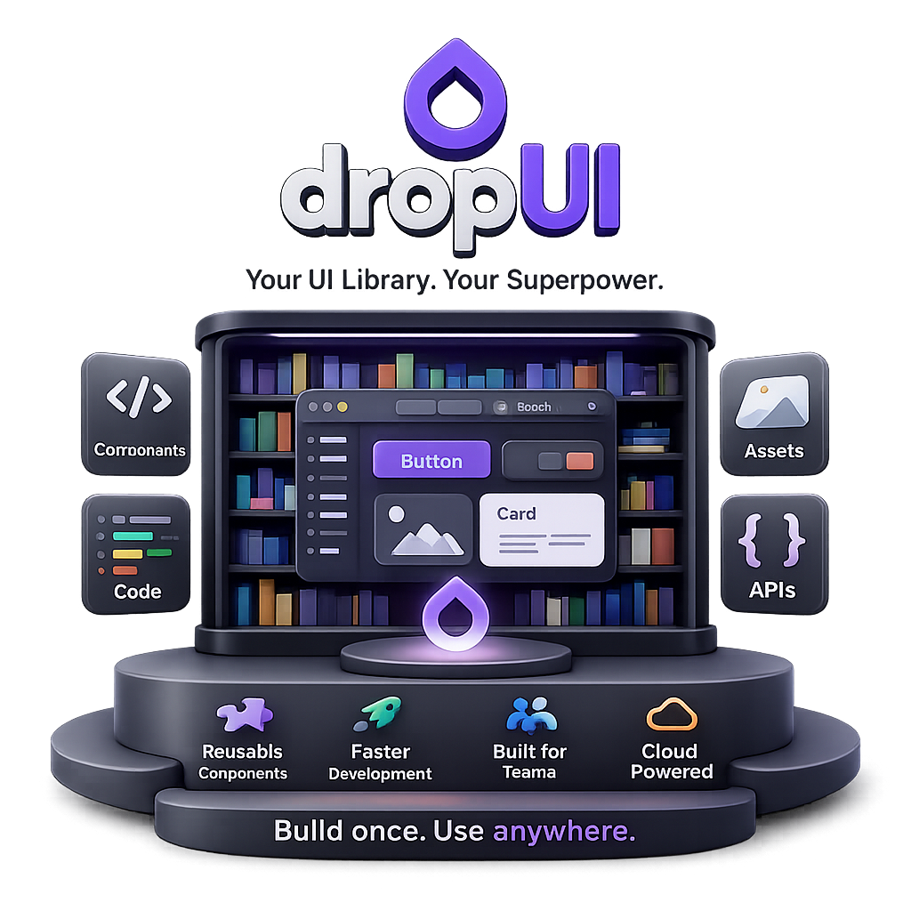

Problem-driven engineering student building **scalable backend systems, AI-powered applications, and IoT solutions**.
Passionate about solving **real-world problems using MERN stack, distributed systems, AI/ML, and embedded technologies**.

---

# 🚀 Projects

## 🛒 Starkk.shop — Scalable MERN E-Commerce Platform

<table>
<tr>
<td width="60%">

Production-level **scalable e-commerce platform** built using MERN stack.

### Key Highlights

• Redis caching for optimized backend performance  
• Elasticsearch-powered product search & filtering  
• Secure authentication and payment integration  
• Dynamic homepage rendering via backend configuration  
• Optimized API architecture and caching workflows  

### 🧰 Tech Stack

`MongoDB` `Express.js` `React.js` `Node.js` `Redis` `Elasticsearch` `Razorpay`

</td>

<td width="40%">

</td>
</tr>
</table>

---

## 🧩 DragFlow — Drag & Drop UI Builder

<table>
<tr>
<td width="60%">

Dynamic **drag-and-drop UI builder** with backend-driven rendering architecture.

### ✨ Features

• Real-time layout customization  
• Reusable component architecture  
• Dynamic JSON-based rendering system  
• Backend-controlled UI management  

### 🧰 Tech Stack

`React.js` `Node.js` `MongoDB` `Context API`

</td>

<td width="40%">

</td>
</tr>
</table>

---

## 🤖 GestureBot — AI Gesture Controlled Robot

<table>
<tr>
<td width="60%">

AI-powered robot controlled using **real-time hand gesture recognition**.

### ✨ Features

• Computer vision-based gesture detection  
• Real-time hand tracking using MediaPipe  
• ESP32-based wireless robot control  
• Low-latency gesture-to-action pipeline  

### 🧰 Tech Stack

`Python` `OpenCV` `MediaPipe` `ESP32`

</td>

<td width="40%">

</td>
</tr>
</table>

---

## 📌 CreatePin — Visual Pin Board Platform

<table>
<tr>
<td width="60%">

Pinterest-style **visual sharing platform** with modern UI and animations.

### ✨ Features

• Pin creation and board management  
• Smooth animations using GSAP & Framer Motion  
• Responsive and interactive frontend  

### 🧰 Tech Stack

`MongoDB` `Express.js` `Node.js` `EJS` `Framer Motion` `GSAP`

</td>

<td width="40%">

</td>
</tr>
</table>

---

## 🖨 Smart Thermal Printer Device

<table>
<tr>
<td width="60%">

IoT-based **wireless thermal printing system** using ESP32.

### ✨ Features

• Browser-based mobile print requests  
• ESP32-hosted lightweight web server  
• Real-time print forwarding workflow  
• Driver-free local network printing  

### 🧰 Tech Stack

`ESP32` `Embedded C` `HTML` `CSS`

</td>

<td width="40%">

</td>
</tr>
</table>

---

# ⏱ Coding Activity

